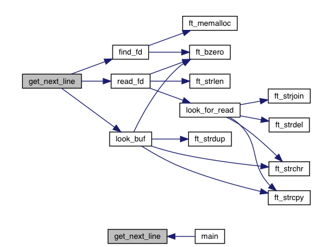

Get next line
=============
Get next line est une fonction qui renvoie une ligne depuis un file descriptor. Une ligne est une suite de caractères terminée par un '\n'.

# Parametres #

### (const int fd) ###
fd est le file descriptor depuis lequel lire.

### char **line ###

line est l'adresse d'un pointeur sur le caractère qui servira à stocker la ligne.
Sur le file descriptor.

# Valeur de retour

+ **1** - Si la ligne a été lue.
+ **0** - Si la lecture est terminée.
+ **-1** - Si il surviens une erreur.

Get next ligne doit renvoyer son resultat sans le '\n'
# Fonctionnement #

Un appel en boucle de la fonction permettra de lire le texte disponible sur un
descripteur de fichier, une ligne a la fois jusqu'à la fin du texte quelque
soit la taille du texte en question ou d'une de ses lignes

Il faut vérifier que la fonction fonctionne bien quand on lit sur un fichier
sur l'entrée standard ou depuis une redirection... etc

Pseudo Code
===========

### Fonction :  t_gnl *find_fd(t_gnl **head, int cont fd)
---------------------------------------------------------

Renvoie un maillion sur notre liste chainee t_gnl

* t_gnl  *new
* t_gnl  *tmp

La fonction recherche dans notre liste le fd correspondant sinon elle va créée un nouveau maillon pour ce fd. Le nouveau maillon est placer au début de la liste.

NOTE : Cree une variable temportaire pour tester la position dans la liste.
       ft_bzero de new->next
	          *head = new

### Fonction :  int   look_buf(t_gnl *item, char **line)
--------------------------------------------------------

* char   *tmp

La fonction cherche la première occurrence (ft_strchr) dans item->buf.

Si la première occurrence est un retour a la ligne le caractère suivant est remplacer par un '\0' on stocke le pointeur dans tmp. (pour la gestion de tout les fichier utiliser memchr et pas qui strchr qui lui s'arrêtera au premier '\0')

Si *ligne != item->buf -> on renvoie 0
On va ensuite tester si tmp existe, s'il existe on copie item-buf dan tmp et on renvoie 1.

Ensuite, on nettoie item->buf

### Fonction :  int   look_for_read(t_gnl *item, char **line)
-------------------------------------------------------------

* char   *tmp
* char   *save

Si la première occurrence est un retour a la ligne le caractère suivant est remplacer par un '\0' on stocke le pointeur dans tmp.

* save = *line

Si on peut, nous allons concaténer *line et item->buf.
Si on ne peut pas concaténer on libère save (strdel) avant de renvoyer -1.

Dans tous les cas, on libère save

Ensuite si tmp existe (tmp = pointeur sur le '\n'), on fait une copie de item->buf dans tmp et on renvoi 1

Si tmp n'existe pas on renvoi 0.
